Guía que contiene información en detalle y de manera clara de cómo realizar la instalación paso a paso del sistema operativo FreeBSD. El video que aquí se referencia sirve como punto de partida, pero se aclara que ésta guía debe ser la que se tenga en cuenta para aclarar cualquier duda.



## Desde dónde descargar FreeBSD

Aunque el sitio de FreeBSD puede contener algunas partes en español, usualmente las encuentro algo desactualizadas, por lo que recomiendo ir directamente a la página de descargas del sitio web en inglés: https://www.freebsd.org/where/

Allí podremos ver las diferentes versiones y arquitecturas disponibles para la descarga del instalador, una imagen de máquina virtual o bien una imagen SD para dispositivos como raspberry y similares.

En nuestro ejemplo y para realizar la instalación paso a paso, vamos a descargar e instalar *FreeBSD 13.0-RELEASE* para la arquitectura de procesador *amd64*:

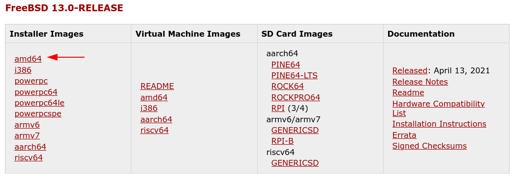

Y posteriormente seleccionamos el archivo que deseemos instalar. Para nuestro ejemplo, la imagen ISO disc1:

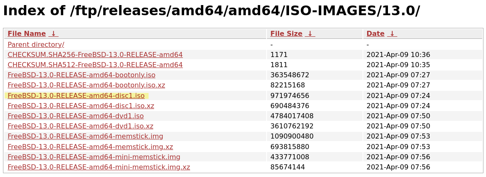

Alternativamente, se puede descargar la versión deseada a través de *torrents*. [Aquí][1] la lista de *magnet links* 

## Pantalla de inicio del instalador

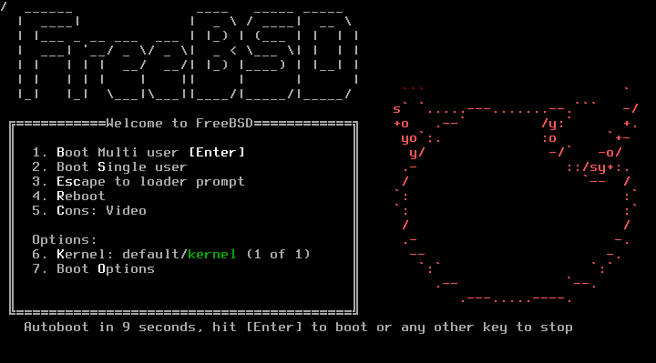

Cuando iniciamos el equipo o máquina virtual seleccionando como medio de arranque el archivo que descargamos previamente (CD ó USB si lo estás haciendo físicamente), nos vamos a encontrar con una información similar a la mostrada en la imagen anterior.

En este punto hemos podido ver que el cargador de arranque (*boot loader*) se ha ejecutado correctamente. Este «inicializador» nos va a servir también en casos en los que debamos recuperar el sistema, por lo que no es mala idea conservar uno.

Oprimimos la tecla *Enter*, o bien cuando pasan 10 segundos, por defecto se inicia el instalador del sistema (*bsdinstall*).

## Bienvenida del instalador

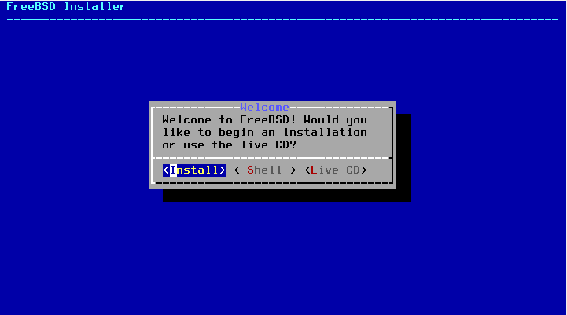

Aquí será suficiente con oprimir la tecla *Enter* mientras está marcada la opción *Install*

## Seleccionar la distribución de teclado

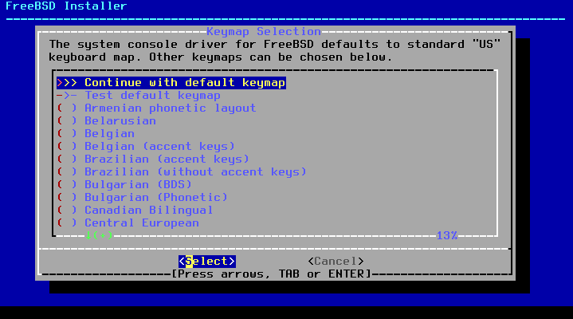

Tenemos a nuestra disposición el poder seleccionar la distribución de teclado para que sea mucho más fácil ingresar caracteres como puntos, tildes, la letra eñe, entre otros; por lo que puedes buscar en la lista la distribución para el teclado que estés usando. 

Voy a suponer que estás usando un teclado en Español, pero distribuciones alternativas como [Dvorak][2] están también disponibles.

Puedes usar las teclas de navegación del teclado (flechas) para desplazarte sobre la lista y luego con la barra espaciadora, seleccionar la distribución de teclado deseada.

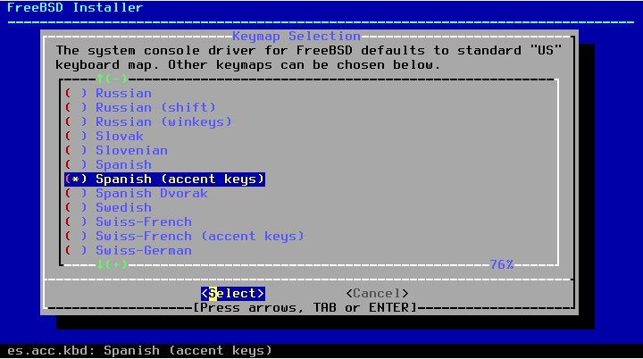

Una vez seleccionado, tienes la opción de probar la configuración antes de continuar

O bien continuar con el proceso usando la distribución de teclado seleccionada:

## Asignar nombre del equipo

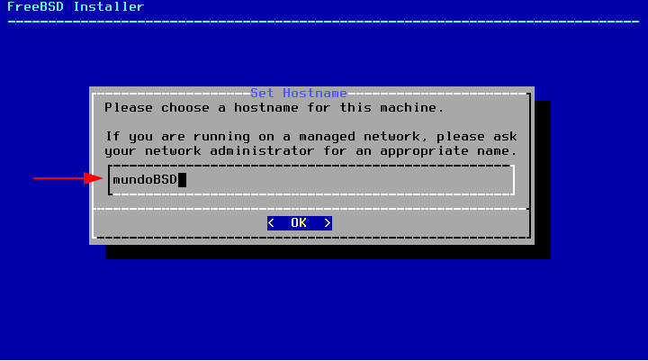

Escribimos el nombre del equipo con el cual lo vamos a identificar. En nuestro ejemplo *mundoBSD*.

Nota: Si estás haciendo la instalción de equipo en una red con dominio, en un centro de datos o en la nube, aquí es bueno poner el *FQN (Fully qualified name)* de este servidor. Ejemplo: *www.mundobsd.com*

## Seleccionar componentes opcionales a instalar

A menos de que quieras hacer desarrollo del sistema operativo propiamente dicho, las opciones que terminan en *-dbg* no se hacen necesarias, así como la opción de *tests*. Lo que nos deja tres opciones:

**lib32**: Selecciona esta opción si necesitas dar compatibilidad a software antiguo que use librerías compiladas para arquitectura de 32 bits (sólo disponible para instalaciones en 64bits).

**ports**: Selecciona esta opción si quieres contar con una colección de archivos *Make* en el equipo que se alojarán en el directorio `/usr/ports/` por defecto. Allí encontrarás otra serie de directorios por categorías de aplicaciones de terceros. Esto te ayudará a automatizar la descarga, compilación e instalación de software de terceros.

Por ejemplo, si quisieras compilar e instalar el gestor de bases de datos Postgresql versión 13, bastará con dirigirte a `/usr/ports/databases/postgresql13-server/` y ejecutar `make install clean`.

Algunos prefieren este método para compilar e instalar aplicaciones de terceros en el sistema ya que les brinda más control; pero no es la única manera, ya que el sistema cuenta con la utilidad [pkg][3] para instalar/desinstalar binarios. En términos generales, es recomendable usar una u otra estrategia para instalar aplicaciones, no ambas.

**src**: Si seleccionas esta opción vas a tener una copia del código fuente del sistema operativo, tanto del *kernel* como de las aplicaciones de usuario (*userland*) en el directorio `/usr/src/`. Será útil en caso de que quieras compilar el sistema operativo con tus propias optimizaciones o personalizaciones.

En caso de que decidieras escoger *ports* y *src*, se cuentan con herramientas para sincronizar y mantener al día éstos directorios, bien sea usando [portsnap][4] para el caso de *ports* o `git` para ambos casos.

Nota: El instalador no verifica espacio disponible en disco, así que si seleccionaste `ports` ten presente que este directorio puede estar ocupando alrededor de 500 MB. Si seleccionaste `src`, este directorio puede estar ocupando alrededor de 1GB y en el momento de la compilación del sistema operativo vas a necesitar unas 5GB adicionales.

## Particionar disco(s)

Si deseas utilizar todo el disco duro y que el instalador decida cómo particionarlo, usa una de las opciones que dice *Auto*. Si sabes lo que estás haciendo y lo prefieres hacer «a lo geek», cuentas con las opciones de *Manual* ó *Shell*.

Tenemos a nuestra disposición dos sistemas de archivos: [ZFS][5] ó [UFS][5] *(Unix file system)*. Tradicionalmente *UFS* ha sido utilizado en FreeBSD y tiene muy buen rendimiento y excelentes características. *ZFS* comenzó a ser parte del sistema operativo desde el año 2007; es un sistema de archivos y administrador de volúmenes a la vez, un poco más nuevo en comparación y tiene algunas características que se pueden aprovechar muy bien.

Si quieres un sistema de archivos a prueba de todo y además con características extra, sin lugar a dudas *ZFS* es el sistema de archivos a utilizar. No te va a dejar a mitad de camino.

Nota: Es recomendable usar *ZFS* en equipos con al menos 1GB de RAM; usar 8GB como mínimo es sin embargo lo sugerido.

Para efectos de esta guía (y como recomendación), uso la opción *Auto (ZFS)*

## Configuración ZFS

En esta pantalla podemos configurar las opciones para *ZFS*. En vista de que estoy asumiendo esta guía como una guía básica, vamos a dejar todo como está y sólo vamos a configurar una opción: *Pool Type/Disks*.

Una vez oprimimos la tecla *Enter* estando en esta opción, vamos a encontrarnos con algo como esto:

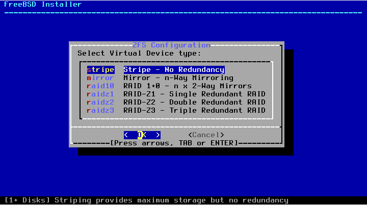

Y aquí vamos a seleccionar *stripe - No redundancy*, y oprimimos de nuevo la tecla *Enter*:

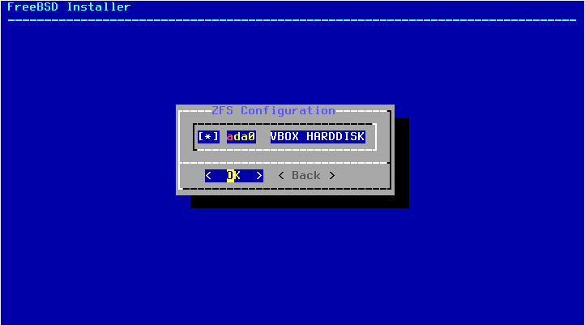

Y nos aseguramos de dejar marcado el disco duro en el cual queremos instalar nuestro sistema y posteriormente de nuevo oprimimos la tecla *Enter* para confirmar nuestra selección.

Ahora debemos estar de vuelta en nuestra pantalla de configuración de *ZFS* y debemos ver que en la opción de *Pool Type/Disks*, ahora dice *stripe: 1 disk*, así:

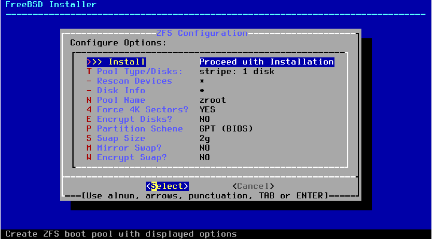

Nos aseguramos de tener marcada la opción *Install* y oprimimos de nuevo la tecla *Enter* para confirmar.

Nota: A menos de que el equipo donde estés instalando el sistema sea muy viejo, es recomendable poner siempre en la opición *Partition Scheme* la configuración [GPT (UEFI)][10].

Por último, nos va a salir un mensaje de confirmación para proceder a formatear por completo el disco seleccionado (todos los datos, si los hay, serán borrados):

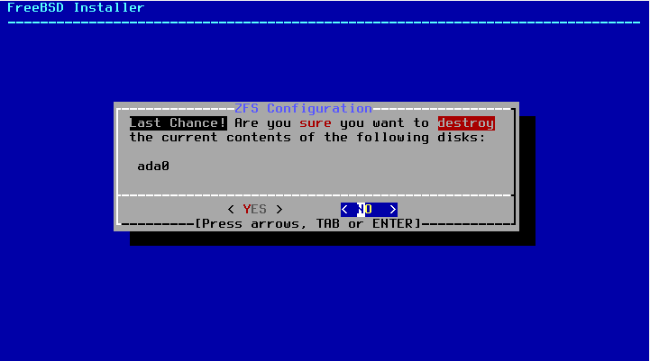

Confirmamos la opición anterior y veremos el progreso más o menos de esta manera:

## Establecer contraseña para el usuario root

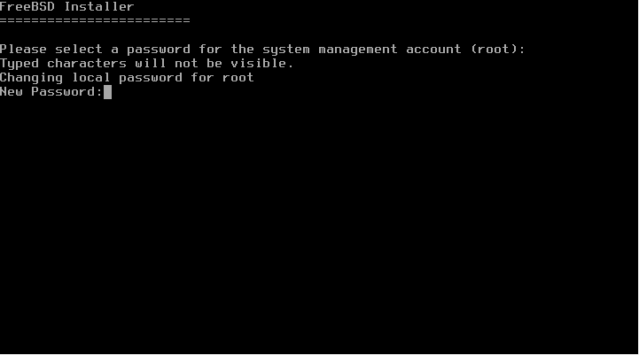

Como en todos los sistemas tipo unix, el usuario «administrador» o el usuario que tiene el control total sobre el sistema, es el usuario llamado *root*. Y en este punto, vamos a establecer su contraseña.

Escribe la clave que le deseas asignar al usuario *root* (no te preocues si ves que no está escribiendo).

Oprimes la tecla *Enter*.

Repites la clave que pusiste anteriormente para confirmar.

Oprimes la tecla *Enter*.

## Configuración de red

En este punto el instalador nos va a permitir seleccionar la interfaz de red através de la cual nos vamos a conectar a la red. Marcamos la deseada y continuamos.

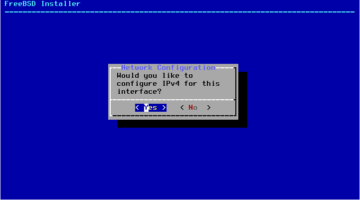

Aquí nos pregunta el instalador si deseamos configurar IPv4 para esta interfaz, para efectos de este ejemplo vamos a marcar la opción *Yes* para proceder a configurarla.

En la gran mayoría de los casos, tanto en redes corporativas como de hogar, es muy probable que ya se cuente con un servidor [DHCP][7] en la red (en hogar usualmente a través del módem de la empresa de internet). Por lo que vamos a seleccionar la opción de *Yes*.

Si todo sale bien, la configuración como la dirección IP del equipo, la puerta de enlace predeterminada de la red y los servidores DNS deben quedar configurados automáticamente. En caso de que no, deberás entonces ingresar estos datos manualmente y el instalador te lo hará saber.

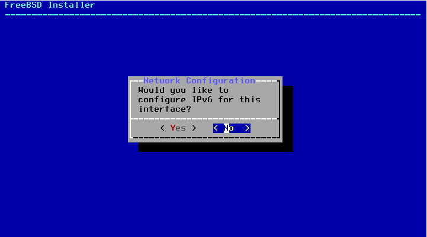

Aquí nos pregunta el instalador si deseamos configurar IPv6 para esta interfaz, para efectos de este ejemplo vamos a marcar la opción *No* y continuamos.

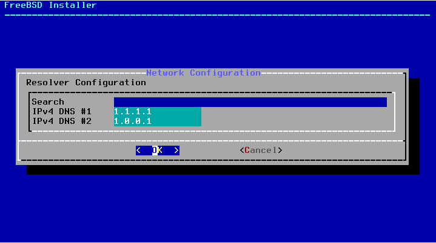

Aquí vamos a ingresar la configuración relativa los servidores [DNS][8] que deseemos utilizar para resolver los nombres de red e internet.

Si la configuración *DHCP* previamente se ejecutó con éxito, seguramente ya tengas estos campos llenos.

En este ejemplo, yo estoy sobreescribiendo esos valores para utilizar los servidores *DNS* de *Cloudflare*, pero puedes usar los que consideres pertinentes. Si tienes dudas, puedes dejar los que te hayan aparecido en principio.

Nota: El campo *search* lo estoy dejando vacío a propósito ya que no aplica para este ejemplo.

## Configuración de zona horaria

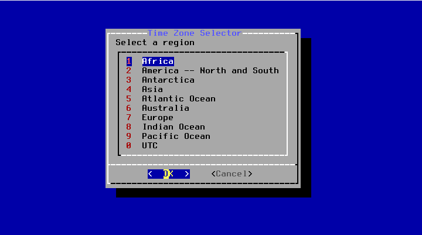

En este pantallazo, debes seleccionar el continente y luego el país donde este equipo estará ubicado (o al menos sus usuarios si es un equipo remoto) para que se configure la zona horaria correspondiente. Ya que debería ser bastante obvio este paso, no me voy a detener en detalle aquí. Al seleccionar el país, debería verse algo como esto:

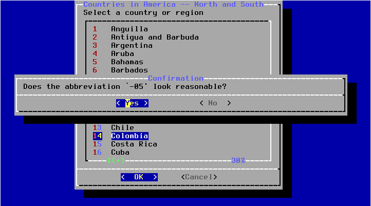

### Fecha y hora

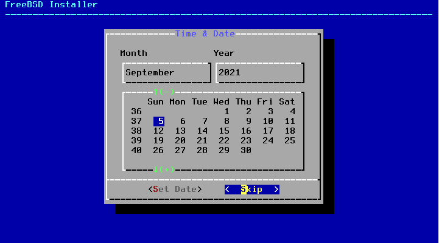

Si la fecha es correcta, continuamos dejando marcada la opción *skip*, de lo contrario debemos seleccionar la opción *Set Date* para especificar el día, mes y año.

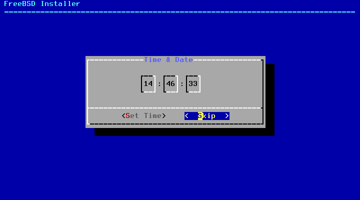

Si la hora es correcta, continuamos dejando marcada la opción *skip*, de lo contrario debemos seleccionar la opción *Set Time* para especificar la hora correspondiente en formato 24 hrs.

## Configuración del sistema

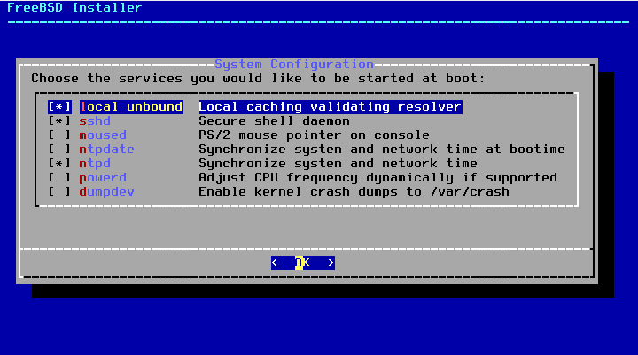

En este punto vamos a poder seleccionar cuáles servicios queremos habilitar (*daemons* en términos del sistema). Esta lista no incluye todos, pero sí algunos importantes. Yo voy a mencionar los tres que he seleccionado:

**local_unbound**: Usualmente lo instalo ya que ayuda mucho a la percepción de velocidad en las conexiones. Este servicio lo que hace es habilitar un servidor DNS de manera local, por lo que las consultas se harán primero a la máquina y luego a los servidores externos si no están los registros.

**sshd**: Si hay un servicio omnipresente puede ser este, en especial en servidores. Este servicio nos permite conectarnos de manera segura y remota a nuestro equipo.

**ntpd**: Sincroniza frecuentemente la hora y fecha del equipo con servidores [NTP][9]. Es importante que nuestro equipo o servidor siempre cuente con la configuración de fecha y hora de manera correcta ya que a veces se pueden presentar errores de validación en certificados *ssl* precisamente por no contar con la hora sincronizada correctamente.

**powerd**: Esta opción siempre la habilito sobre todo cuando estoy haciendo la instalación en un equipo portátil. Es muy útil ya que regula la frecuencia de la CPU, por lo que ayuda a consumir menos energía cuando el equipo está funcionando únicamente con la batería.

## Configuración de seguridad

Este es un buen pantallazo para los paranóicos. Analiza muy bien cuáles de las opciones que aquí aparecen pueden ser útiles para tu caso de uso. Si estás instalando un equipo o servidor que va a ser utilizado por diferentes usuarios, puede ser interesante tener las tres primeras opciones habilitadas no sólo por seguridad, sino también por privacidad.

A parte de mencionar esas tres primeras, meciono la opción de *clear_tmp*, que lo que hace es vaciar el directorio `/tmp` cada vez que se inicia el sistema. Algunos podrán debatir si esto es realmenete una opción de seguridad o no; yo simplemente la siento conveniente para cualquier caso.

Nota: Si no tienes claro cuáles habilitar y es tu primera experiencia con el sistema, entonces no selecciones ninguna, así el aprendizaje será más fácil. Igualmenete éstas opciones se puede habilitar/deshabilitar posterior a la instalación.

## Agregar usuarios

Aquí el instalador nos va a permitir agregar usuarios al sistema. Para efectos de este ejemplo y como recomendación general, vamos a agregar al menos un usuario estándar. En este caso el usuario `juan`. Lo único que debemos hacer es ir contestando las preguntas que el asistente nos va a ir mostrando.

Las opciones que aparecen entre corchetes `[ ]`, son las que el asistente va a poner por defecto en caso de que no indiquemos o escribamos algo.

Al final se puede ver algo como esto:

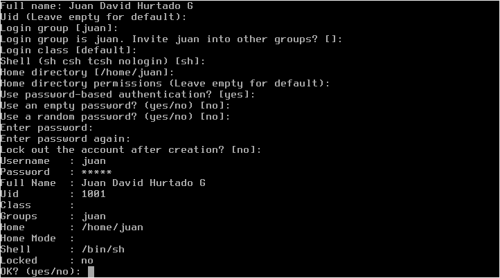

Una vez se crea el primer usuario, el asistente nos va a preguntar si deseamos agregar más usuarios y repetiremos la acción de ser necesario. Para este ejemplo únicamente vamos un solo usuario.

## Finalizar

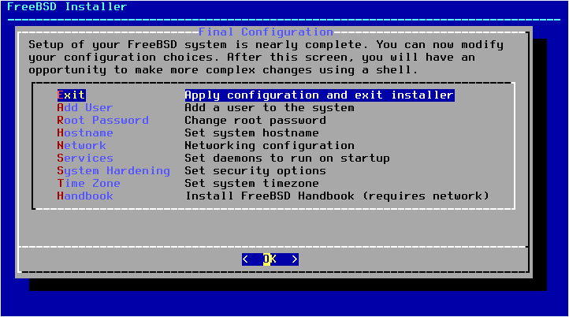

El instalador nos va a presentar un pantallazo final en donde podremos hacer cambios a opciones que ya hemos configurado. Aquí bastará con dejar la opción de *Exit* seleccionada para terminar la instalación y proceder a reiniciar el sistema e ingresar a nuestro recién instalado FreeBSD.

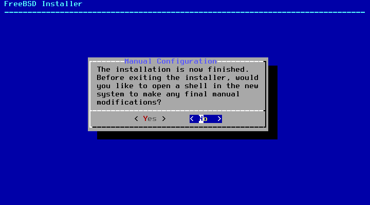

Asegúrate de retirar el medio de instalación, para que cuando reinicies, el sistema pueda iniciar desde el disco duro con el nuevo sistema instalado:

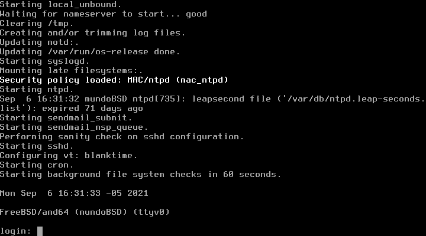

Y eso es todo, en próximas entregas podremos ver algunas primeras tareas a ejecutar en el sistema o incluso cómo instalar un entorno gráfico para usar el sistema como nuestro equipo de trabajo.

¿Qué quieres hacer ahora? ¿qué nuevo proyecto quieres emprender?

Deja tus comentarios y comparte el conocimiento

[1]: https://people.freebsd.org/~jmg/FreeBSD-13.0-R-magnet.txt
[2]: https://es.wikipedia.org/wiki/Teclado_Dvorak "Artículo en Wikipedia de la distribución de teclado Dvorak."
[3]: https://www.freebsd.org/cgi/man.cgi?query=pkg&apropos=0&sektion=0&manpath=FreeBSD+13.0-RELEASE&arch=default&format=html "Página del manual de la utilidad pkg"
[4]: https://www.freebsd.org/cgi/man.cgi?query=portsnap&apropos=0&sektion=0&manpath=FreeBSD+13.0-RELEASE&arch=default&format=html "Página del manual de la utilidad portsnap"
[5]: https://es.wikipedia.org/wiki/ZFS_(sistema_de_archivos) "Artículo en wikipedia sobre ZFS"
[6]: https://es.wikipedia.org/wiki/Unix_File_System "Artículo en wikipedia sobre UFS"
[7]: https://es.wikipedia.org/wiki/Protocolo_de_configuraci%C3%B3n_din%C3%A1mica_de_host "Artículo en Wikipedia sobre el protocolo DHCP"
[8]: https://es.wikipedia.org/wiki/Sistema_de_nombres_de_dominio "Artículo en Wikipedia sobre el sistema de resolución de nombres de dominio"
[9]: https://es.wikipedia.org/wiki/Network_Time_Protocol "Artículo en Wikipedia sobre el protocolo de tiempo de red"
[10]: https://es.wikipedia.org/wiki/Unified_Extensible_Firmware_Interface "Artículo en Wikipedia sobre UEFI"